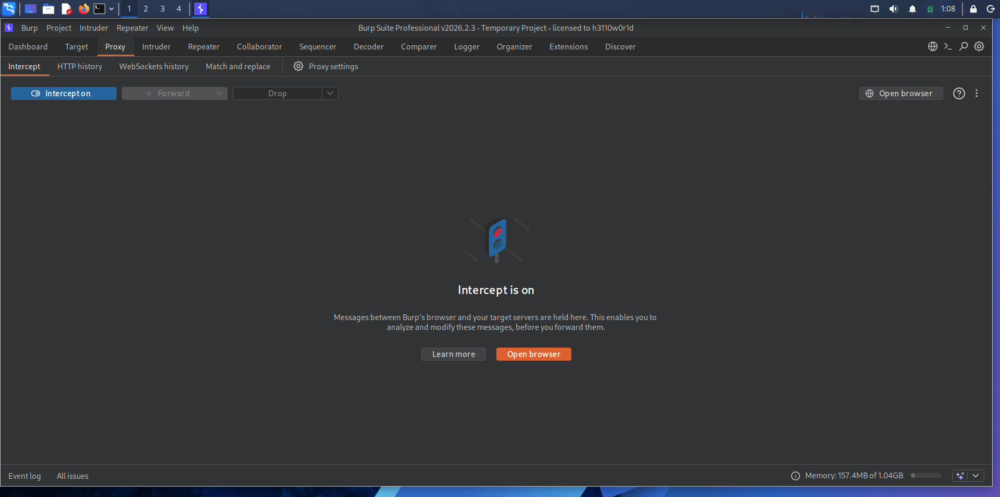
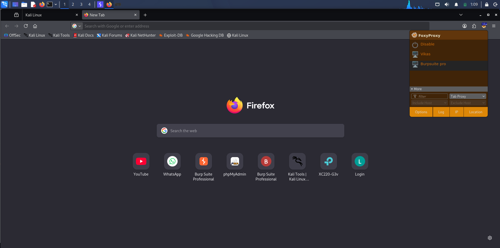
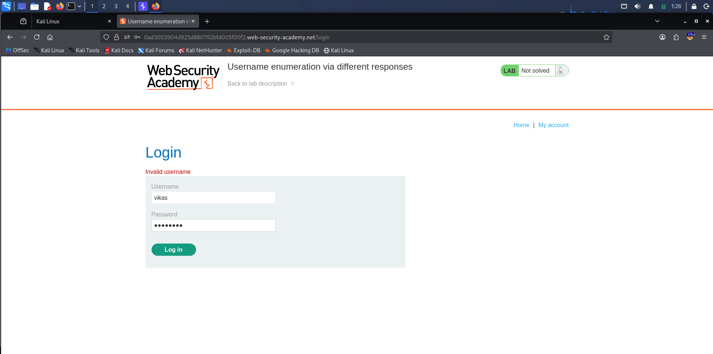
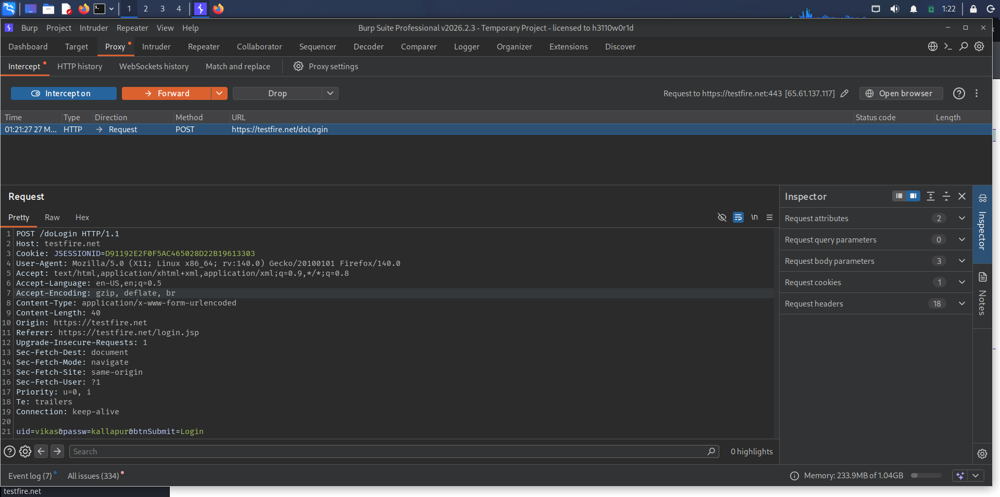
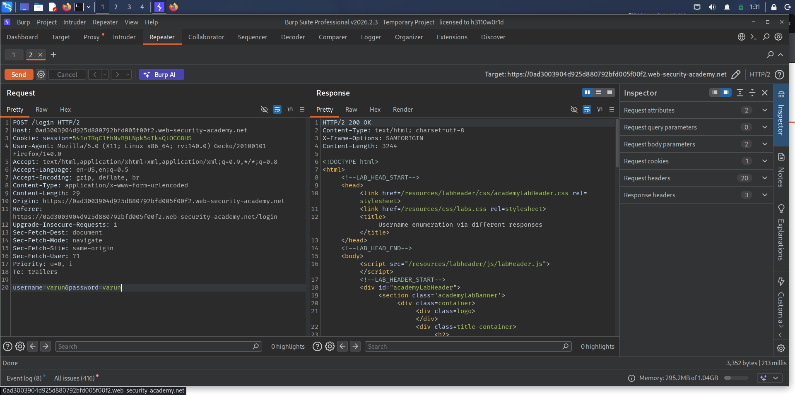
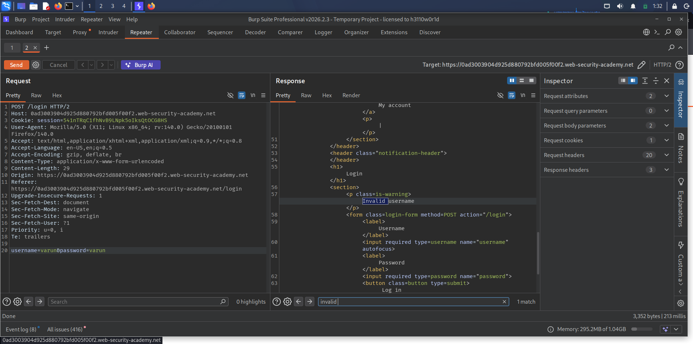
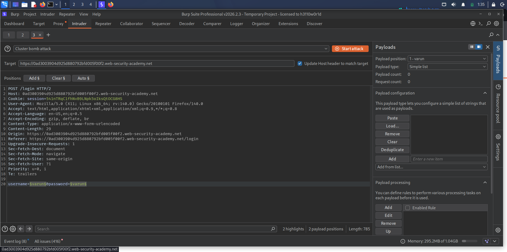
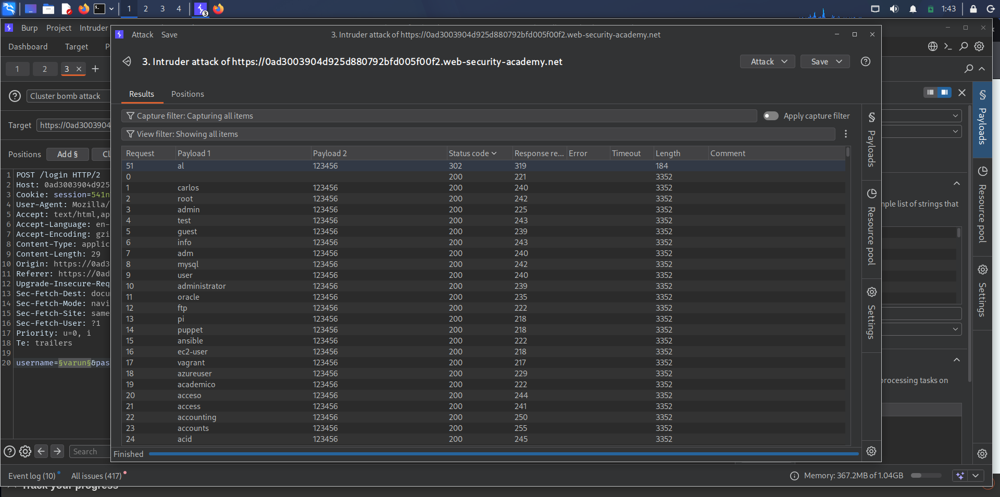
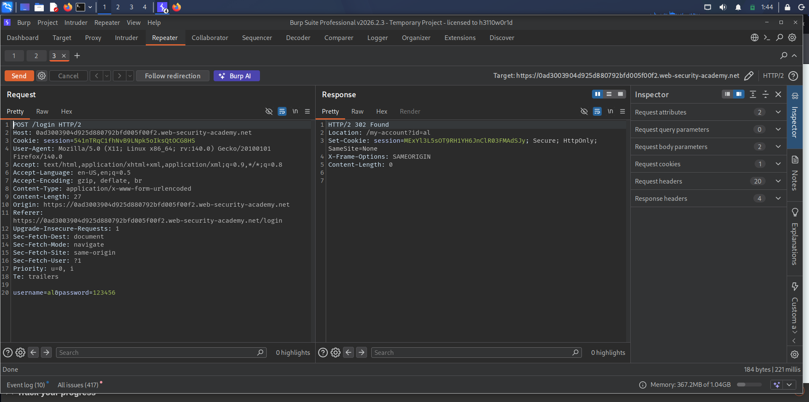
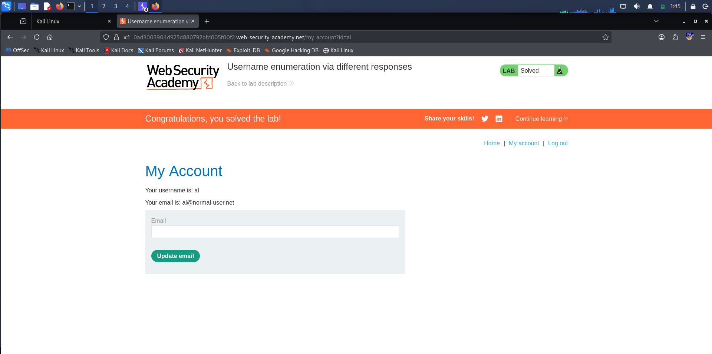

## Introduction

Authentication mechanisms are a critical component of web application security, as they control access to sensitive data and user accounts. 
Weak or improperly implemented authentication systems can allow attackers to gain unauthorized access through techniques such as brute-force attacks or credential guessing.

---

## Objective

1. To understand how Burp Suite works
2. To intercept and analyze HTTP requests
3. To perform attacks like SQL Injection and XSS
4. To use tools like Repeater and Intruder
5. To identify vulnerabilities and suggest fixes

---

## Step-by-Step Guide

---

## Task 1: Intercepting Request

* Start Burp Suite and enable Proxy
* Open browser and capture request
  

---
## Task 2: Configure Browser Proxy (Firefox)

* Open Firefox browser
* Go to **Settings → Network Settings → Manual Proxy Configuration**
* Set the proxy as:

  * HTTP Proxy: `127.0.0.1`
  * Port: `8080`
* Enable **“Use this proxy server for all protocols”**
* Click **OK** to save settings
* Ensure Burp Suite Proxy is running and interception is ON

---

## Task 3: Capture Login Request from Target Application

* Open the vulnerable web application (PortSwigger Lab)
* Navigate to the **Authentication/Login page**
* Enter a random or incorrect username and password
* Submit the login form
* Intercept the request in Burp Suite Proxy
* Observe the captured HTTP request containing login parameters

---

## Task 4: Send Captured Request to Intruder

* Select the intercepted login request in Burp Suite
* Right-click on the request
* Click on **“Send to Intruder”**
* Navigate to the Intruder tab
* Verify that the request has been successfully loaded
  

---
## Task 5: Modify Request and Analyze Response
* Go to the modified request in Intruder or Repeater
* Change the username and password values manually
* Click on Send to forward the request
* Observe the server response
  

---
## Task 6: Analyze Response in Repeater
* Check the response returned by the server in the Repeater tab
* Observe the HTTP status code (200 OK) in the response
* Analyze the response body/content
* Even after modifying credentials, the response shows:
* “Invalid username or password”
*This indicates that authentication was unsuccessful despite receiving a 200 OK response

---
## Task 7: Perform Brute Force Attack Using Intruder

* Send the captured request to the **Intruder** tab  
* Navigate to the **Positions** section  
* Select the **username** and **password** parameters  
* Click on **“Add §” (Add Positions)** to mark them for attack  
* Choose the attack type as **Cluster Bomb**  
* Move to the **Payloads** tab  
* Add payload lists:
  - Provide a list of possible **usernames**  
  - Provide a list of possible **passwords**  
* Ensure both payload sets are configured correctly  
* Click on **“Start Attack”**
  

---
## Task 8: Identify Valid Credentials from Intruder Results

* After the attack is completed, observe the results in the **Intruder** tab  
* Click on the **Status Code** column to sort the responses  
* Identify responses with a different status code (e.g., **302 Found**)  
* Compare these responses with others (e.g., 200 OK)

---
## Task 9: Verify Valid Credentials Using Repeater

* Identify the username and password combination that returned **302 Found** in Intruder  
* Example:
  - Username: **al**  
  - Password: **123456**  

* Send this request to the **Repeater** tab  
* Replace the parameters with the identified valid credentials  
* Click on **“Send”** to forward the request

---
## Task 10: Login to Application Using Valid Credentials

* Navigate back to the main web application login page  
* Enter the identified valid credentials:
  - Username: **al**  
  - Password: **123456**  
* Click on the **Login** button
* The application successfully logs in with the provided credentials
  
  

## Results

* Identified authentication vulnerabilities
* Successfully tested attack methods

---

## Conclusion

The project demonstrates a practical **authentication vulnerability assessment** using Burp Suite. By performing controlled brute-force testing, 
valid credentials were discovered, confirming the importance of implementing strong authentication protections in web applications.
